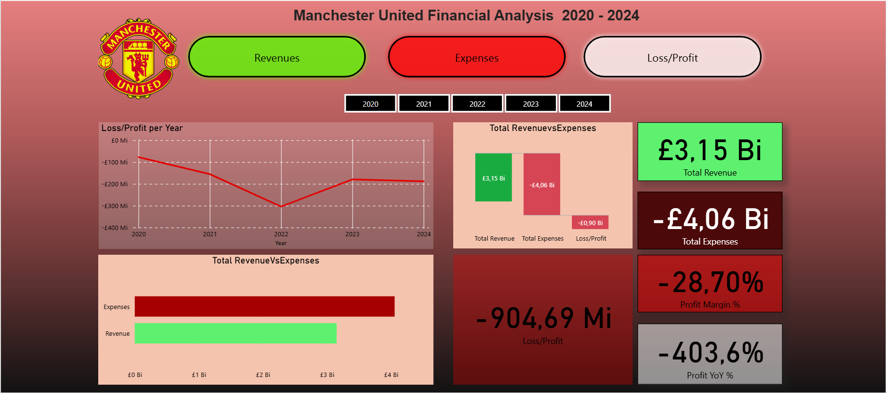

# Manchester United Financial Analysis - Last 5 Years

## Overview
This project presents an analysis of **Manchester United's financial performance 2020-2024** using Power BI. Interactive dashboards explore revenues, expenses, and overall trends.

## Preview

## Features
- Annual revenues and expenses visualizations  
- Comparison of net profit/loss over the last 5 years  
- Breakdown by revenue sources (player transfers, broadcasting, Matchday, etc.)  
- Interactive charts for detailed insights  

## Tools
- Power BI Desktop  
- Excel / CSV for raw data

## Data Source
The data used in this project comes from **Official Manchester United financial reports**, published annually by the club:  
[Manchester United Annual Reports](https://ir.manutd.com/financial-information/annual-reports)

## Author
Bruno Vellozo
