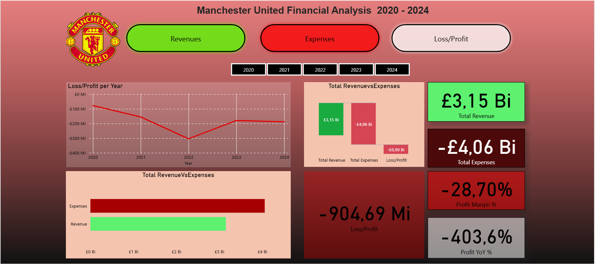

# Manchester United Financial Analysis - Last 5 Years

## Overview
This project presents an analysis of **Manchester United's financial performance (2020–2024)** using Power BI.  

The financial data was originally published as **PDF reports** by the club. I extracted the information, transformed it into **Excel** using **Power Query**, and modeled the data to prepare it for visualization.  

This process highlights my ability to:
- Collect and clean data from non-structured sources (PDFs)  
- Use Power Query for **ETL (Extract, Transform, Load)** operations  
- Build a reliable data model in Power BI  
- Create interactive dashboards that explore revenues, expenses, and overall financial trends

## Features
- Annual revenues and expenses visualizations  
- Comparison of net profit/loss over the last 5 years  
- Breakdown by revenue sources (player transfers, broadcasting, Matchday, etc.)  
- Interactive charts for detailed insights  

## Expenses Preview

## Revenues Preview

## Loss/Profit Preview

## Dashboard Overview

The Power BI dashboard is divided into three main sections: **Expenses**, **Revenues**, and **Loss/Profit**. Each section contains multiple visualizations and key performance cards to provide a clear overview of Manchester United's financial performance over the last five years.

### Expenses
- **Clustered Column Chart**: Shows the types of expenses, including **Amortization, Depreciation, Employee Expenses, Operating Expenses, and Transfer Expenses**.  
- **Donut Chart**: Displays the **Expense Distribution**.  
- **Stacked Column Chart**: Shows **Total Expenses per Year**.  
- **Cards**: Highlight **Highest Expense Component, Expenses Year-over-Year %, Transfer Expenses, Profit Year-over-Year %, and Total Expenses**.

### Revenues
- **Clustered Column Chart**: Shows the types of revenue, including **Commercial Revenue, Broadcasting Revenue, Matchday Revenue, and Transfer Income**.  
- **Donut Chart**: Displays the **Revenue Distribution**.  
- **Stacked Column Chart**: Shows **Total Revenue per Year**.  
- **Cards**: Highlight **Highest Revenue Component, Revenue Year-over-Year %, Transfer Income, Profit Year-over-Year %, and Total Revenue**.

### Loss/Profit
- **Line Chart**: Shows **Loss/Profit per Year**.  
- **Stacked Bar Chart**: Compares **Total Revenue vs Total Expenses**.  
- **Waterfall Chart**: Also compares **Revenue vs Expenses** to show financial changes.  
- **Cards**: Highlight **Total Revenue, Total Expenses, Profit Margin %, Profit Year-over-Year %, and Total Loss/Profit**.

## Tools
- Power BI Desktop  
- Excel / CSV for raw data

## Data Source
The data used in this project comes from **Official Manchester United financial reports**, published annually by the club:  
[Manchester United Annual Reports](https://ir.manutd.com/financial-information/annual-reports)

## Author
Bruno Vellozo
