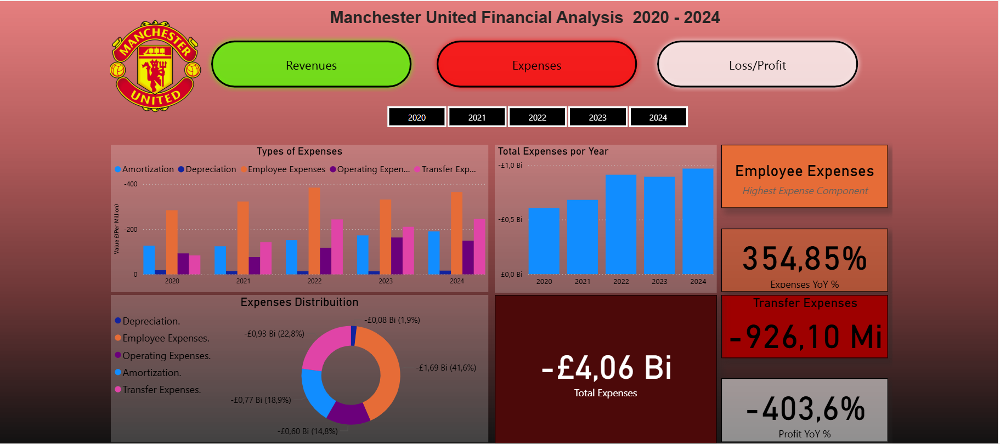
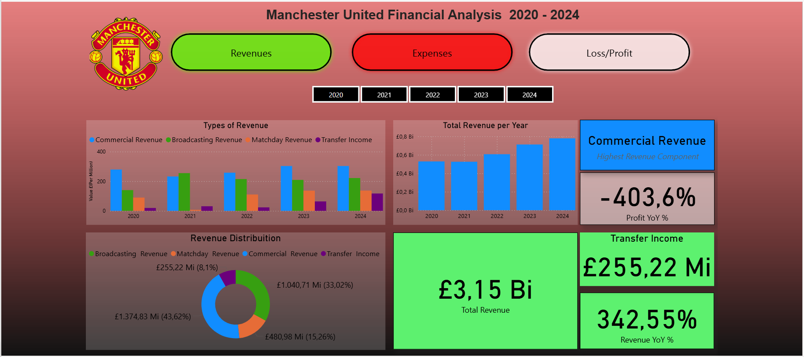

# Manchester United Financial Analysis - Last 5 Years

## Overview
This project presents an analysis of **Manchester United's financial performance (2020–2024)** using Power BI.

The financial data was originally published as **PDF reports** by the club. I extracted the information, transformed it into **CSV** using **Power Query**, and modeled the data to prepare it for visualization.  

## Features
- Annual revenues and expenses visualizations  
- Comparison of net profit/loss over the last 5 years  
- Breakdown by revenue sources (player transfers, broadcasting, Matchday, etc.)  
- Interactive charts for detailed insights  

## Expenses Preview

## Revenues Preview

## Loss/Profit Preview

## Dashboard Overview

The Power BI dashboard is divided into three main sections: **Expenses**, **Revenues**, and **Loss/Profit**. Each section contains multiple visualizations and key performance cards to provide a clear overview of Manchester United's financial performance over the last five years.

### Expenses
- **Clustered Column Chart**: Shows the types of expenses, including **Amortization, Depreciation, Employee Expenses, Operating Expenses, and Transfer Expenses**.  
- **Donut Chart**: Displays the **Expense Distribution**.  
- **Stacked Column Chart**: Shows **Total Expenses per Year**.  
- **Cards**: Highlight **Highest Expense Component, Expenses Year-over-Year %, Transfer Expenses, Profit Year-over-Year %, and Total Expenses**.

### Revenues
- **Clustered Column Chart**: Shows the types of revenue, including **Commercial Revenue, Broadcasting Revenue, Matchday Revenue, and Transfer Income**.  
- **Donut Chart**: Displays the **Revenue Distribution**.  
- **Stacked Column Chart**: Shows **Total Revenue per Year**.  
- **Cards**: Highlight **Highest Revenue Component, Revenue Year-over-Year %, Transfer Income, Profit Year-over-Year %, and Total Revenue**.

### Loss/Profit
- **Line Chart**: Shows **Loss/Profit per Year**.  
- **Stacked Bar Chart**: Compares **Total Revenue vs Total Expenses**.  
- **Waterfall Chart**: Also compares **Revenue vs Expenses** to show financial changes.  
- **Cards**: Highlight **Total Revenue, Total Expenses, Profit Margin %, Profit Year-over-Year %, and Total Loss/Profit**.

### Analysis & Insights

**2020/2021:**  
- Revenue decreased slightly due to COVID-19 impacts on **Matchday Revenues**.  
- Expenses remained relatively high, especially **employee and operating expenses**, leading to a small reduction in profit.  
- Transfer expenses were moderate, helping to partially offset revenue losses.  
- On the other hand, **broadcasting revenue skyrocketed due to COVID-19**, increasing from **£140M in 2020 to £254M in 2021** (~81% increase).  
- Since then, broadcasting revenue has **never fallen below £200M**, showing strong resilience in this revenue stream after COVID-19.

**2021/2022:**  
- Revenues recovered significantly, thanks to the **return of fans to stadiums**, which restored **Matchday Revenue to approximately £100M**.   
- Total expenses increased slightly, mainly due to **Player Wages and Player Transfers**.
- This year also recorded the **highest loss** in the period, totaling **£304M**.

**2022/2023:**  
- **Matchday revenue** began returning as stadium attendance increased.  
- This period saw the **highest year-on-year revenue growth** in the analyzed timeframe and **the only period in which the club reduced its total debt** compared to the previous year.
- Overall, this was the **est period for the club in terms of trying to balance finances**, showing strong recovery and cost management.

**2023/2024:**  
- Revenues stabilized across **all streams**, with broadcasting and commercial revenue being the largest contributors.  
- Expenses continued to rise modestly, but careful cost management maintained profitability.  
- This was the year with the **highest spending on player transfers** (£246M), significantly impacting **Total Expenses** 
- It was also the year that **generated the highest transfer income**, totaling **£117M**, boosting overall revenue.  

**Key Takeaways:**  

- The **COVID-19 pandemic** had a significant impact on the club's **Matchday Revenues**, but on the other hand, it **revolutionized broadcasting revenue**, which has remained much higher in the following years compared to pre-pandemic levels.  
- The club's revenues are **consistently growing year after year**, showing that they are doing a good job in generating income.  
- However, the club is **spending more than it generates**, leading to **losses in almost every year**.  
- **2022** was the **worst year in terms of loss/profit**, with a **£304M loss** and an **increase of £230M in expenses** compared to the previous year.  
- **2023** was the **only year in which total expenses decreased** compared to the previous year. It was also the year with the **largest revenue increase**. This year can be considered a **model for balancing finances**, showing how to achieve higher revenue while controlling expenses.

## Solution / Recommendations

Based on the financial analysis of Manchester United (2020–2024), the following recommendations can help improve the club's financial stability and profitability:

1. **Control Transfer Spending:**  
   - Player transfer expenses are consistently high, often exceeding revenues.  
   - Implement a more strategic transfer policy, focusing on value-for-money signings and avoiding excessive spending in a single season.

2. **Maximize Revenue Streams:**  
   - Broadcasting and commercial revenue are strong and resilient.  
   - Continue to expand commercial deals and explore new sponsorship opportunities.  
   - Maintain high engagement with fans to support Matchday Revenue growth.

3. **Optimize Operational Costs:**  
   - Employee and operational expenses are major cost drivers.  
   - Review contracts and operating costs to identify potential savings without affecting performance.

4. **Use 2023 as a Model Year:**  
   - This year successfully **reduced expenses** while achieving the **highest revenue growth**.  
   - Implement similar strategies in future seasons: balance spending, prioritize high-return investments, and control recurring costs.

**Outcome:**  
By implementing these measures, the club can aim for **consistent profitability**, better financial health, and more strategic growth in the coming years.

## Tools
- Power BI Desktop – for data modeling, dashboards, and visualizations
- Excel / CSV – for raw data handling, cleaning, and transformations
- Power Query – for extracting and transforming data from PDFs to Excel
- DAX (Data Analysis Expressions) – for creating calculations, measures, and KPIs in Power BI
- Data Cleaning & Transformation Techniques – handling messy data from PDFs
- Data Visualization & Reporting – creating charts, cards, and dashboards
- Git & GitHub – version control, repository management

## Data Source
The data used in this project comes from **Official Manchester United financial reports**, published annually by the club:  
[Manchester United Annual Reports](https://ir.manutd.com/financial-information/annual-reports)

## Author
**Name:** Bruno Vellozo  
**Email:** brunopvellozo@gmail.com  
**LinkedIn:** https://www.linkedin.com/in/brunopvellozo
